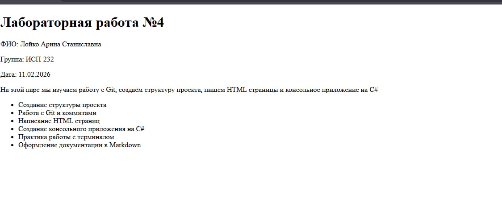
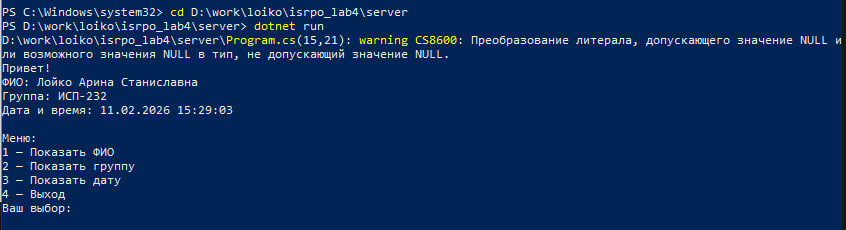
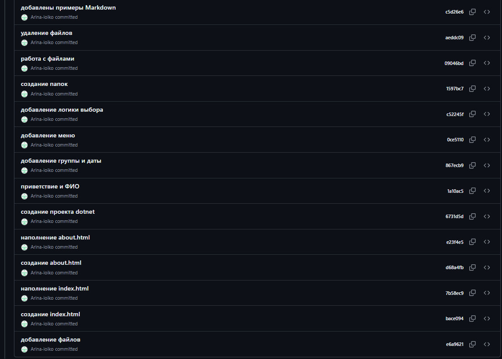

# Лабораторная работа №4

**ФИО:** Лойко Арина Станиславна
**Группа:** ИСП-232
**Дата:** 11.02.2026

---

## Описание проекта

Лабораторная работа по закреплению навыков работы с Git, Markdown, терминалом и проектной структурой. В работе создан frontend на HTML, консольное приложение на C#, выполнена практика терминала и оформлена документация в Markdown.

---

## Содержание

- [Структура проекта](#структура-проекта)
- [Frontend](#frontend)
- [Backend](#backend)
- [Практика терминала](#практика-терминала)
- [Примеры Markdown](#примеры-markdown)
- [Скриншоты](#скриншоты)
- [Заключение](#заключение)

---

## Структура проекта

```
isrpo_lab4/
├── client/
│   ├── index.html
│   └── about.html
├── server/
│   ├── Program.cs
│   └── server.csproj
├── terminal_practice/
│   ├── logs/
│   │   └── app.log
│   └── data/
│       └── text.txt
├── docs/
│   └── markdown_examples.md
├── repo/
│   ├── browser_Loiko.png
│   ├── backend_Loiko.png
│   ├── terminal_Loiko.png
│   └── git_Loiko.png
└── README.md
```

---

## Frontend

Файл `client/index.html` содержит заголовок, ФИО, группу, дату и список выполняемых задач.
Файл `client/about.html` содержит информацию об авторе.

## Backend

Консольное приложение на C# в папке `server/`. Запуск:

```
cd server
dotnet run
```

## Практика терминала

В папке `terminal_practice/` созданы папки `logs/` и `data/`, файлы `app.log` и `text.txt`, выполнено копирование и удаление файлов.

---

## Примеры Markdown

### Заголовок

# H1
## H2
### H3

### Список

- Пункт один
- Пункт два
- Пункт три

### Картинка



### Код

```
git status
git add .
git commit -m "сообщение"
```

---

## Пример LaTeX

Inline: $a^2 + b^2 = c^2$

Block:

$$
\sum_{i=1}^n i = \frac{n(n+1)}{2}
$$

---

## Ссылка на репозиторий

[https://github.com/Arina-loiko/isrpo_lab4](https://github.com/Arina-loiko/isrpo_lab4)

---

## Скриншоты

### Браузер — index.html


### Backend — dotnet run



### Терминал — структура папок


### История коммитов на GitHub



---

## Заключение

В ходе лабораторной работы закреплены навыки работы с Git и GitHub, создана структура проекта, написаны HTML страницы, консольное приложение на C#, выполнена практика терминала и оформлена документация в Markdown.
